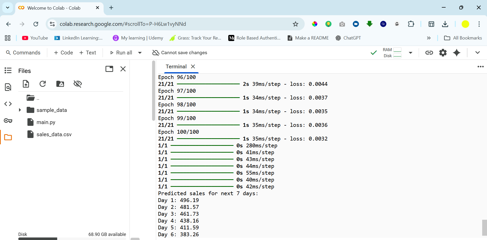

# Advanced Future Prediction AI

This project is a **multi-feature LSTM-based predictive AI model** that forecasts future numerical values, such as sales, stock prices, or other time-series data. It uses historical data and additional features (like day of week and month) to make **robust multi-step predictions**.

---

### Demo :


## Features

- **Multi-step prediction**: Predicts multiple days into the future.
- **Multi-feature input**: Includes day of week, month, and customizable features.
- **Stacked LSTM architecture**: Deep neural network with dropout for better generalization.
- **Scalable & extensible**: Easily add more features like holidays, promotions, or weather.
- **Visualization**: Plots historical data and future predictions.

---

## Requirements

- Python 3.8+
- Packages:
  - numpy
  - pandas
  - matplotlib
  - scikit-learn
  - tensorflow

Install dependencies with:

```bash
pip install numpy pandas matplotlib scikit-learn tensorflow
````

---

## Data Format

Your input CSV file should contain at least:

| date       | sales |
| ---------- | ----- |
| 2025-08-01 | 100   |
| 2025-08-02 | 120   |
| ...        | ...   |

* `date` must be in YYYY-MM-DD format.
* `sales` is the numerical value you want to predict.
* Additional features (optional) can be added, e.g., `day_of_week`, `month`.

---

## Usage

1. Place your CSV file in the project folder (e.g., `sales_data.csv`).
2. Modify the `DATA_FILE` variable in the script to your file name.
3. Run the script:

```bash
python predictive_ai.py
```

4. The model will:

   * Train on historical data.
   * Predict the next 7 days (customizable).
   * Plot actual vs predicted values.
   * Display future predictions in the console.

---

## Customization

* **Change sequence length**: Modify `SEQ_LENGTH` to use more or fewer past days for prediction.
* **Change prediction horizon**: Modify `N_DAYS` for longer or shorter forecasts.
* **Add more features**: Include extra columns in your CSV and update `features` list in the code.

---

## Future Enhancements

* Real-time prediction updates with live data.
* Web dashboard for interactive visualization.
* Multi-target prediction for multiple metrics.
* Integration with APIs for live data feeds.

---

## License

This project is open-source and available under the MIT License.

---

## Author

**Shiboshree Roy** – AI Developer & Researcher
